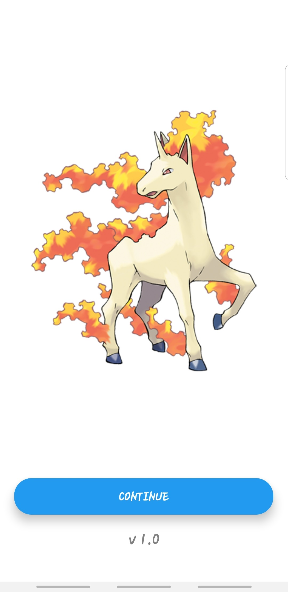
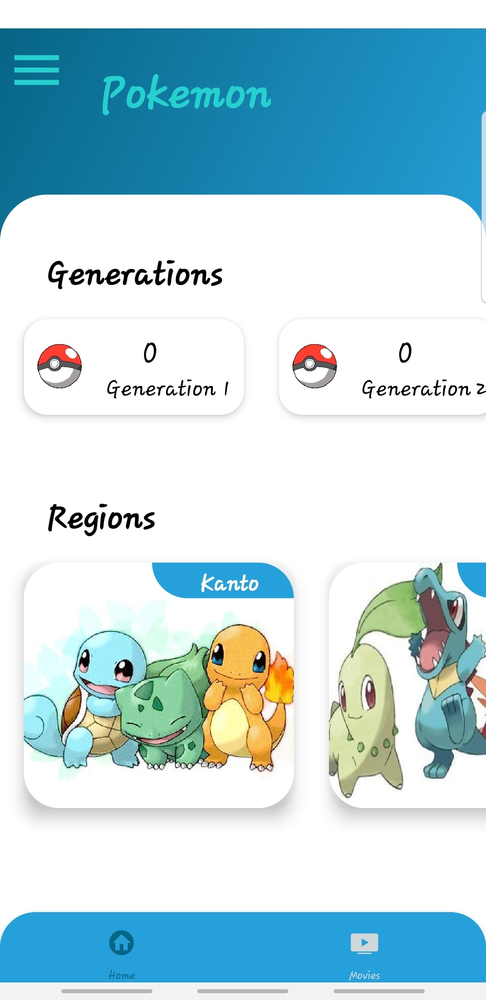
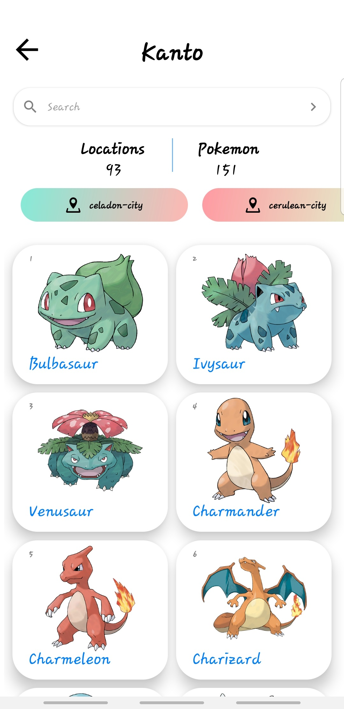
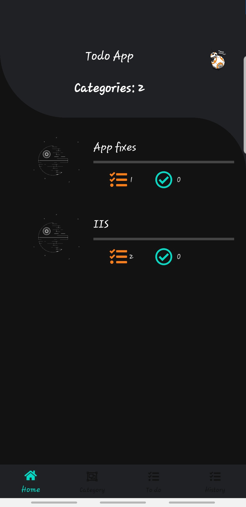
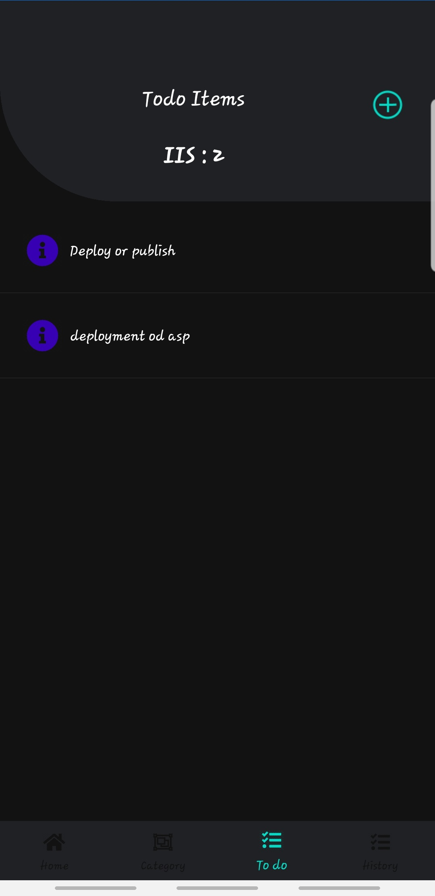
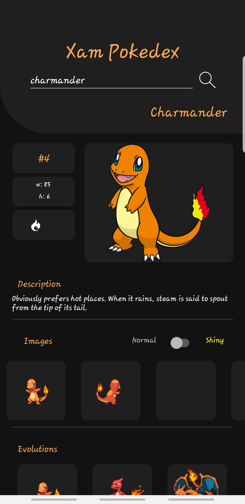

<div align="center">

<br />
<br />
</div>
<h1 align="center"><span>
 </span> Yusuf Khan <span>
 </span></h1>  
<h3 align="center">A Full Stack Developer from South Africa</h3>

<div align="center">
  <p>  </p>
</div>

```csharp
private void YusufKhan()
{
  try {
    string const CurrentOrg = "Bidvest Data";

    List<string> Code = new {
      "csharp", "javascript", "HTML", "CSS", "Java"
    };

    List<string> Tools = new {
      "visual studio", "visual studio code", "sql", "aws", "google cloud", "Automation"
    };

    List<string> Frameworks = new {
      "blazor", ".net 6", ".net 7", ".net core", "react", "react native", "maui applications", "web api", "nodejs"
    };

      List<string> Projects = new {
      "Code Arena Hub", "Nebula System Solutions"
    };
  }
  catch(Exception ex)
  {
      Console.WriteLine(ex.Message)
  }
}
```

  <div align="center">
    <a>
      
    </a>

</div>

 <div align="center" style="margin-top: 20px">

**My Projects Samples:**

  <p>
    
    
    
    
    
    
    
    
  </p>

</div>
