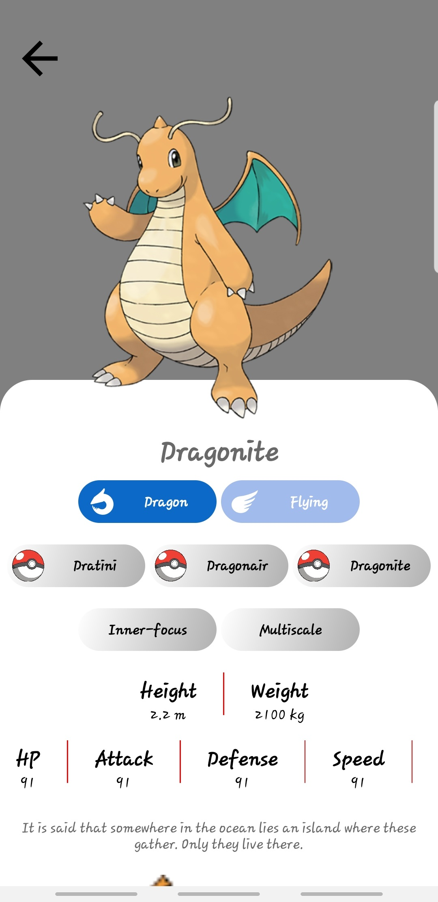
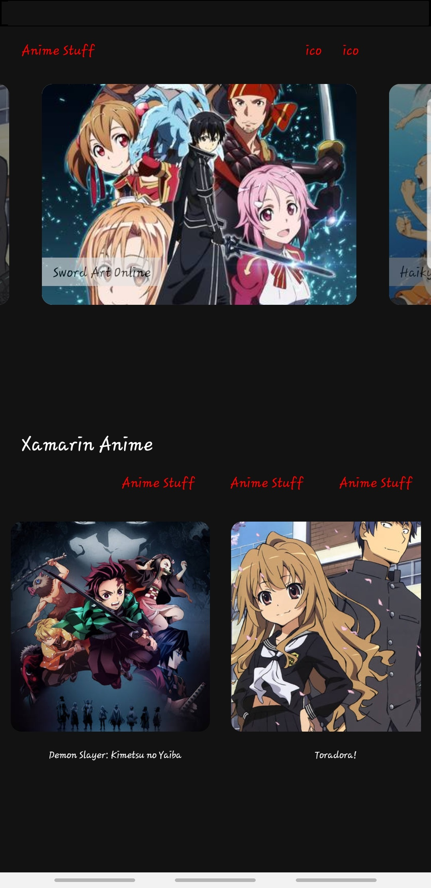

### Yusuf Khan

 

I currently Work on

- C# .Net
- .Net Core 5.0 and 6.0
- Xamarin Forms
- Blazor
- Javascript
- Nodejs
- Expo - React Native
- SQL
- MySql
- Google Cloud Platform

**Personal Info:**

- I am Yusuf Khan | [YusufDev101](https://github.com/YusufDev101)
- Software Developer
- I currently work at Bidvest Data.
- I also work on side projects in [Code Arena Hub](https://github.com/CodeArenaHub).

 

**My Projects Samples:**

<h5>React Native / Expo Pokemon</h5>

  
  
  
  
  
  
  

<h5>Xamarin Todo App</h5>

  
  
  
  
  
  
  
  

<h5>Xamarin Pokedex</h5>

  
   

<h5>Xamarin Anime</h5>

  

